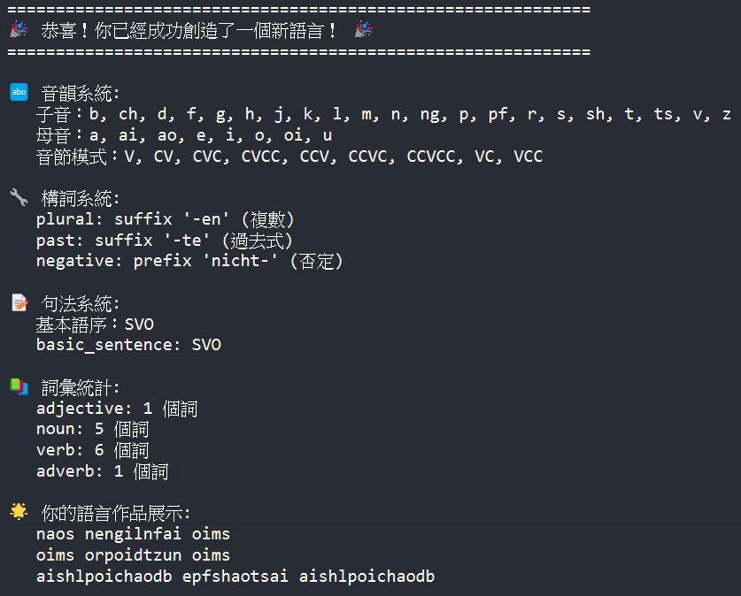

# Mock-Deutsch Creator

# 德語
## 1. 語料
[變形記 - 德文版](https://www.projekt-gutenberg.org/kafka/verwandl/chap001.html)
[變形記 - 英文版](https://www.gutenberg.org/cache/epub/5200/pg5200.txt)
## 2. 規則
#### 音韻
- **音節結構**：['V', 'CV', 'CVC', 'CVCC', 'CCV', 'CCVC', 'CCVCC', 'VC', 'VCC']
- **子音**：['p', 'b', 't', 'd', 'k', 'g', 'm', 'n', 's', 'z', 'l', 'r', 'f', 'v', 'j', 'h', 'sh','ch', 'ng', 'pf', 'ts']
- **母音**：['a', 'e', 'i', 'o', 'u', 'ai', 'ao', 'oi']
#### 構詞
- 名詞複數型：有多種變化，以後綴 `-en` 為代表。
- 動詞過去式：有多種變化，以後綴 `-te` 為代表。
#### 句法
- 語序：動詞第二位原則，在這裡選擇 `SVO` 呈現。

## 3. 執行結果
